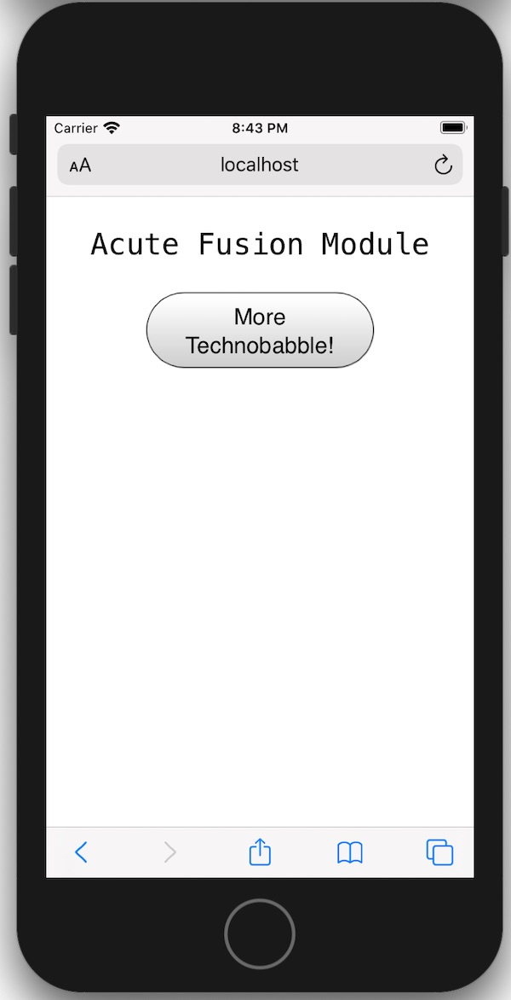
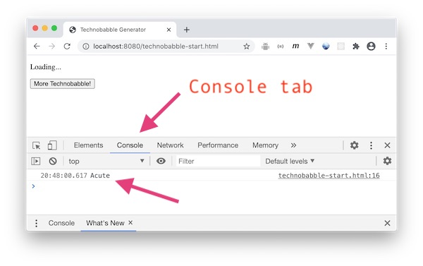

# HW - Technobabble Generator

- The walkthrough video for this assignment is here --> 

## I. Overview

- Let's build a simple "Technobabble" JavaScript application:
  - What is *Technobabble*? --> https://www.youtube.com/watch?v=4RmKTAkNacw
- When the app starts up, it gives us a random string of *technobabble*, pulled from 3 arrays
- When the user clicks the button, they get to see some new *technobabble*
- Here's a screenshot of the finished product:

<hr>


<hr>

- We'll even make it look acceptable on mobile phone

<hr>



<hr>

## II. Start Code

- When constructing a JavaScript web app that runs in a web browser, we are usually using at least 3 distinct computer *languages*:
  - [HTML](https://developer.mozilla.org/en-US/docs/Web/HTML) - to determine the *structure* of the page, which includes text elements such as headings and paragraphs, as well as interactive elements such as buttons and text input fields
  - [CSS](https://developer.mozilla.org/en-US/docs/Web/CSS) - *presentation*
  - [JavaScript](https://developer.mozilla.org/en-US/docs/Web/JavaScript) - *behavior*
- You can also think of these languages as tools to build three distinct *layers* of simple browser app
- With a larger app, we would place the HTML, CSS, and JavaScript into their own separate files, but today we'll keep things simple and keep all of the HTML/CSS/JS code in a single file 
- Go ahead and copy the following code and save it as a file to your desktop - name it **technobabble-start.html** 
  

**technobabble-start.html**
```html
<!DOCTYPE html>
<html lang="en">
<head>
	<meta charset="utf-8" />
	<title>Technobabble Generator</title>
	<style></style>
	<script>
	"use strict";
	
	const words1 = ["Acute", "Aft", "Anti-matter", "Bipolar", "Cargo", "Command", "Communication", "Computer", "Deuterium", "Dorsal", "Emergency", "Engineering", "Environmental", "Flight", "Fore", "Guidance", "Heat", "Impulse", "Increased", "Inertial", "Infinite", "Ionizing", "Isolinear", "Lateral", "Linear", "Matter", "Medical", "Navigational", "Optical", "Optimal", "Optional", "Personal", "Personnel", "Phased", "Reduced", "Science", "Ship's", "Shuttlecraft", "Structural", "Subspace", "Transporter", "Ventral"];
	
	const words2 = ["Propulsion", "Dissipation", "Sensor", "Improbability", "Buffer", "Graviton", "Replicator", "Matter", "Anti-matter", "Organic", "Power", "Silicon", "Holographic", "Transient", "Integrity", "Plasma", "Fusion", "Control", "Access", "Auto", "Destruct", "Isolinear", "Transwarp", "Energy", "Medical", "Environmental", "Coil", "Impulse", "Warp", "Phaser", "Operating", "Photon", "Deflector", "Integrity", "Control", "Bridge", "Dampening", "Display", "Beam", "Quantum", "Baseline", "Input"];
	
	const words3 = ["Chamber", "Interface", "Coil", "Polymer", "Biosphere", "Platform", "Thruster", "Deflector", "Replicator", "Tricorder", "Operation", "Array", "Matrix", "Grid", "Sensor", "Mode", "Panel", "Storage", "Conduit", "Pod", "Hatch", "Regulator", "Display", "Inverter", "Spectrum", "Generator", "Cloud", "Field", "Terminal", "Module", "Procedure", "System", "Diagnostic", "Device", "Beam", "Probe", "Bank", "Tie-In", "Facility", "Bay", "Indicator", "Cell"];

	console.log(words1[0]);
</script>
</head>
<body>
<p id="output">Loading...</p>
<button id="myButton">More Technobabble!</button>
	
</body>
</html>
```

- this doesn't do much yet, and the CSS is missing, but we'll rectify that soon
- load **technobabble-start.html** into a web browser (Chrome, Firefox, or Safari all work nicely), 
- now confirm that it is working by checking the console and verifying that the first element of the `words1` array has been logged out:
  - to open the developer console on Chrome, right-click in the window and choose Inspect, then find and click on the **Console** tab
  - you should see the following:

<hr>



<hr>

## III. Demo

- Now we'll build this together - see the video link at the top of this page
- Issues we'll need to tackle:
  - How to get random elements out of the 3 arrays:
    - **TIMTOWTDI** - pronounced *"Tim Toady"* - there is more than one way to do it: 
      - https://stackoverflow.com/questions/4550505/getting-a-random-value-from-a-javascript-array
      - https://en.wikipedia.org/wiki/There%27s_more_than_one_way_to_do_it
  - How to 
  

## IV. Review Questions

- What are the 3 distinct *layers* of a (simple) web browser app?
- What are the 3 *languages* used to program these layers?
- What does `"use strict";` do?
- What is accomplished by using the `const` declaration when declaring and initializing the three arrays of words?
- Can elements be added and deleted from the `words1`, `words2`, and `words3` arrays?
- What symbol does a CSS *id selector* always start with?

## V. Reference

- https://love2dev.com/blog/javascript-strict-mode/
- https://developer.mozilla.org/en-US/docs/Web/JavaScript/Reference/Strict_mode
- https://developer.mozilla.org/en/docs/Web/JavaScript/Reference/Statements/const
- https://developer.mozilla.org/en-US/docs/Mozilla/Mobile/Viewport_meta_tag
