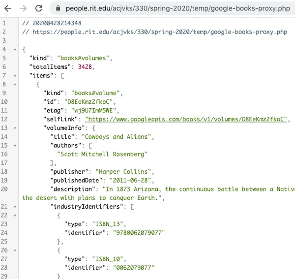

# Simple Proxy Server

## I. Overview 

- the **shout-proxy.php** server from [HW-php-web-service-5.md](./HW-php-web-service-5.md) was used to download data from the SHOUTIFY web service
- the SHOUTIFY web service is problematic (and not typical) because it requires POST requests, where any additional parameters must be passed in a separate file
- what if the web service you have just uses plain old GET requests (where the web service parameters are encode in the query string) - how do you handle it?
- much more simply! see below!

## II. The web service we need to download
- The google books API is free and easy to use - go check it out now - here we are passing in a `q` parameter with a value of `books`:
  - https://www.googleapis.com/books/v1/volumes?q=western
  - see the first screenshot below
- But there's one major issue with this web service - CORS is NOT turned on:
  - we know this because the `Access-Control-Allow-Origin: *` header is missing (see the second screenshot below)
  
  <hr>
  
  
  
  <hr>
  
  
   
  <hr>
   
   ## III. Our Google Books Proxy Server
   
   ****
   
```php
   <?php
	  $q = "space alien westerns"; // hard-coded
	  // Spaces are not allowed in URLS - so we need to write code to handle that issue
	  // in case the user of this script passes in a value with spaces
	  // this next line of code will change any spaces that are passed into
	  // the script into %20 - which is the hexadecimal for 32 - which is the 
	  // ASCI value of a space
	  // https://www.php.net/manual/en/function.rawurlencode.php
	  $q = rawurlencode($q);
	  $URL = "https://www.googleapis.com/books/v1/volumes?q=$q";
	  $result = file_get_contents($URL, false);

	  header('content-type:application/json'); // tell the requestor that this is JSON
	  header("Access-Control-Allow-Origin: *"); // turn on CORS so that our client doesn't have to be on banjo to use this proxy server
	  echo $result;
  ?>
```
  
<hr>

- here's the working URL and a screenshot: https://people.rit.edu/acjvks/330/spring-2020/temp/google-books-proxy.php

<hr>
  


<hr>
